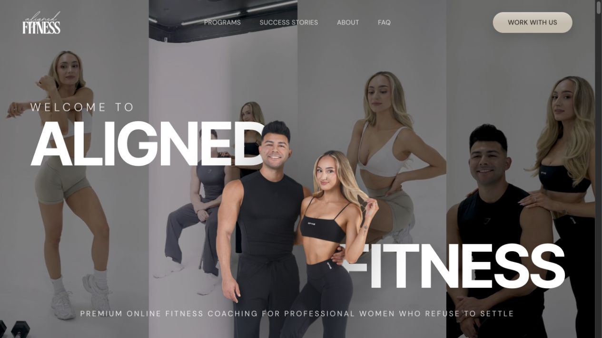
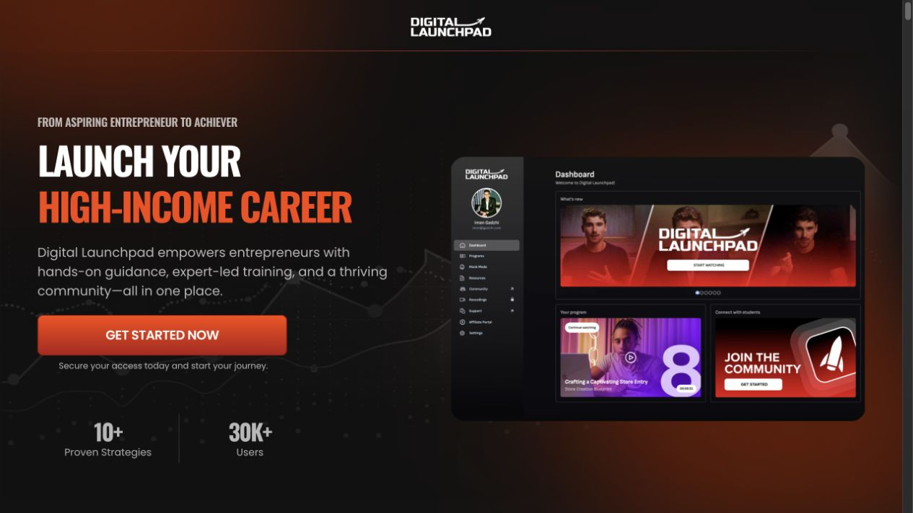

# Education & Consulting Design

An AI agent skill for turning an education, coaching, consulting, or info-product brief into a concrete website design and visitor journey—ready for a website builder.

It defines the layout, visual system, responsive behavior, content slots, and where every action leads. It does not deploy a website or connect a backend.

[Read the skill](SKILL.md) · [Explore the references](references/reference-atlas.md) · [View the journey research](references/reference-journeys.md) · [Download ZIP](https://github.com/ai-saas-wizard/education-consulting-design/archive/refs/heads/main.zip)

## What you get

| Output | Contents |
| --- | --- |
| `design-handoff.md` | Chosen visual direction, page inventory, desktop/mobile wireframes, design tokens, section specifications, component states, and acceptance criteria |
| `journey-map.md` | Navigation, CTA destinations, application/booking or enrollment flow, form requirements, success/error states, and unresolved dependencies |
| `asset-manifest.md` | Required images and media, aspect ratios, crop guidance, source and rights status, and missing assets |
| `brand/` | Logo set (primary, reversed, mark), favicon and social share image, generated when you don't have them, plus the concepts and prompts used |
| `design-tokens.css` | Every color, font, size, spacing and radius as CSS variables for the builder |
| `design-preview.html` | A static, nonfunctional preview of the first screen and key sections, built from the chosen reference's measured tokens |
| `design-references/` | Copies of the reference screenshots each section is modeled on, so the builder can match them (not for deployment) |

“Barebone” means a resolved design structure with clear content and asset slots. It does not mean an empty template.

## How it works

1. **Interview.** The skill asks about your offer and journey gaps, then always about design: which reference look, how closely to follow it, what to leave out, your brand assets, the imagery you have, and must-haves. Say “you decide” to accept its recommendations.
2. **Reference system.** It loads the measured fonts, colors, spacing and components of the look you chose ([visual systems](references/visual-systems.md)) and views the reference frame for every section it designs.
3. **Brand assets.** If you have no logo, it asks a few logo questions, proposes three concepts in the chosen style and builds your pick as SVG with a favicon and social image. On Codex it can also explore symbols with the built-in image generator. On Claude without an image tool, it draws the SVG and gives you a ready prompt for ChatGPT, Ideogram or Recraft.
4. **Preview and compare.** It builds `design-preview.html`, screenshots it at the reference capture size, fixes differences against the reference frames, and asks for your approval.
5. **Handoff.** It writes the handoff, journey map and asset manifest. Builder rules at the top of the handoff tell the builder to keep the look intact.

## Install

### Codex

Clone the skill into your personal skills directory:

```sh
mkdir -p ~/.codex/skills
git clone https://github.com/ai-saas-wizard/education-consulting-design.git ~/.codex/skills/education-consulting-design
```

If you use a custom `CODEX_HOME`, place the folder in its `skills` directory instead. Start a new task if your current task's skill list has not refreshed.

To update an existing clone:

```sh
git -C ~/.codex/skills/education-consulting-design pull --ff-only
```

Do not clone over an existing installation. Keep any local changes before updating.

### Download without Git

1. Download the [ZIP](https://github.com/ai-saas-wizard/education-consulting-design/archive/refs/heads/main.zip).
2. Extract it and rename the extracted directory to `education-consulting-design`.
3. Put the whole directory inside your agent's supported skills directory. Keep `SKILL.md`, `agents/`, and `references/` together.

### Other agents

The instructions are Markdown with skill frontmatter. Use them with an agent that supports directory-based `SKILL.md` skills, following that agent's installation convention. The `agents/openai.yaml` file supplies Codex metadata; other agents can use `SKILL.md` and its relative references directly. Cross-agent behavior has not been independently tested.

No API keys, package installation, or paid connector is required for the skill itself. The agent needs file access and image viewing to use the saved reference library. Live reference research additionally needs browser/web access.

## Use it

```text
Use $education-consulting-design to design a website for my executive
coaching business. The audience is first-time managers. The main action
is applying for a consultation. Follow the Aligned look closely.
Create the design handoff, journey map, and asset manifest for our builder.
```

For a course or membership:

```text
Use $education-consulting-design for an online public-speaking academy.
We sell a self-paced course with weekly group feedback. Follow the Launchpad
look with curriculum, instructor credibility, pricing, enrollment,
and access-confirmation states. Mark missing facts instead of inventing them.
```

Useful inputs include your audience, offer, traffic source, primary action, brand assets, actual proof, prices/terms, existing funnel decisions, and the reference look you want. The skill asks about anything missing before it designs. Unknown facts you can't answer yet are recorded as dependencies, not invented.

## Pair it with a builder

```text
Business brief
    ↓
Education & Consulting Design
    ↓
design-handoff.md + journey-map.md + asset-manifest.md
    ↓
Your website builder
    ↓
Implementation, integrations, testing, deployment
```

The output matches the inspected input contract of the companion `website-generation` skill. That companion is not bundled or required: any builder that accepts a concrete design brief can consume the files.

Example follow-up:

```text
Use our website builder with design-handoff.md, journey-map.md, and
asset-manifest.md. Preserve the selected visual direction and visitor flow.
Resolve the listed business dependencies before implementing those parts.
```

Invoking the design skill alone does not authorize publishing, creating provider accounts, submitting forms, or making payments.

## Reference library

The skill includes 62 desktop screenshots, two contact sheets, a local HTML gallery, measured visual systems (fonts, colors, spacing and components taken from each reference's CSS), section descriptions, conversion research, and public visitor-journey observations.

| Reference | What it contributes |
| --- | --- |
| [Aligned Fitness](https://www.alignedfitnesscoaching.org/) | Soft-minimal coaching look (Inter Tight and DM Sans on warm ivory), founder photography, proof, team, and application flow |
| [Digital Launchpad](https://join.digital-launchpad.com/) | Dark product-led presentation, course catalog, membership progression, pricing, and checkout entry |
| [Metabolic Makeover Academy](https://www.metabolicmakeoveracademy.org/) | Engagement method, delivery details, fit criteria, and qualification flow |
| [IELTS Advantage](https://www.ieltsadvantage.com/) | Expert-led education, course purchase, diagnostic, and free-learning paths |

### Visual references

| Aligned Fitness | Digital Launchpad |
| --- | --- |
|  |  |

Open the [reference atlas](references/reference-atlas.md) for section mappings, or download the repository and open `references/screenshots/gallery.html` in a browser. GitHub displays the gallery's source rather than hosting it as a website.

**Research date:** 17 September 2026. Captures overlap; larger sections span multiple frames. Some animations appear faded and some lazy-loaded images were absent. These are desktop references, not mobile captures. Descriptions document the gaps.

Public navigation and conversion entry points were inspected. Applications and payments were not submitted, so later states are marked as site-stated or unverified. Reference prices and links can change. No measured conversion uplift is claimed.

## Repository structure

```text
education-consulting-design/
├── SKILL.md
├── README.md
├── LICENSE
├── NOTICE.md
├── agents/
│   └── openai.yaml
└── references/
    ├── brand-assets.md
    ├── conversion-principles.md
    ├── handoff-contract.md
    ├── high-converting-landing-page.md
    ├── reference-atlas.md
    ├── reference-journeys.md
    ├── visual-systems.md
    └── screenshots/
        ├── gallery.html
        ├── aligned-contact-sheet.jpg
        ├── launchpad-contact-sheet.jpg
        └── … section and flow captures
```

## Design boundaries

- Match the chosen reference's visual system (type, color roles, spacing, components). Never reuse its logo, name, photos, copy or results.
- Use genuine client evidence. Missing testimonials, credentials, prices, policies, and outcomes remain visible dependencies.
- Map every designed interaction, including error, back, cancellation, confirmation, and access-help states where relevant.
- Separate observed behavior, publisher claims, proposed behavior, and unknowns.
- Treat conversion ideas as hypotheses, not guarantees.

## Validation and contributions

The skill passed Codex's skill metadata validator. Local relative documentation links and packaged files were checked.

On 28 September 2026 the previous and current versions were scenario-tested with Claude subagents on the same briefs.
- **Previous version:** skipped the design questions and chose its own "original" palette and fonts.
- **Current version:** interviewed the owner first, reproduced the chosen reference's tokens (Aligned and Launchpad), compared screenshots against the reference frames, and generated an SVG logo set.

Codex's image-generation path and the IELTS system were not exercised. None of this certifies design quality, conversion performance, or every agent integration.

Issues and focused pull requests are welcome. Include the use case, proposed change, and an example of how it improves the resulting handoff. For reference updates, record the inspection date, source URL, and access limits. Do not contribute credentials, private client material, or fabricated results.

## License and reference rights

Original skill instructions and original supporting material are available under the [MIT License](LICENSE). Third-party screenshots, trademarks, quoted material, and the supplied research guide are excluded from that grant; see [NOTICE.md](NOTICE.md). Reference screenshots are not licensed production assets. No referenced business sponsors or endorses this project.
